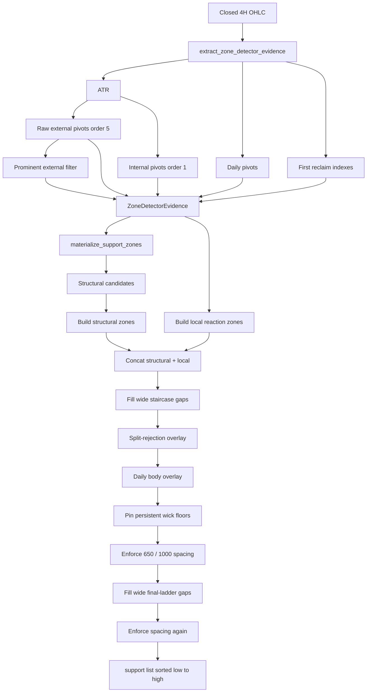

# Zones Finder Algo Overview

This document explains the current support-zone detector (`support_structure_v1`) as it exists in the repo today. It is the algorithm that draws the price bands the trading engine later buys against. It does **not** decide BUY or HOLD. That is a separate engine (`support_close_v1`).

Read this as: “how do we turn a history of closed 4H candles into a sorted ladder of support bands?”

## What it is trying to do

Price does not bounce off a single dollar. It bounces off a **shelf** — a band a few hundred dollars thick, formed by swing lows, reclaimed old highs, long-wick dumps, and (sometimes) daily structure.

The finder builds that ladder on **closed Binance `BTCUSDT` 4H candles only**. It never looks at an open/incomplete 4H bar. Live cycles fetch 1H and derive closed 4H first; the detector itself only sees the 4H frame.

The output is a list of support zones, sorted low → high. Zones currently **above** price stay in that list. The detector labels them `price_state = "resistance"` or `"active"`, but trading still uses the full `support` list so a “broken” shelf can still be an entry target from below.

`resistance` and `active` lists in the return value are always empty. Everything lives under `support`.

## Where the code lives

Detector pipeline (pure, no database):

- `src/zones/detector.py` — orchestration only: extract evidence, then materialize zones
- `src/zones/incremental.py` — stateful 4h ingest that snapshots the same `ZoneDetectorEvidence` bag
- `src/zones/ohlc.py` — clean OHLC + ATR
- `src/zones/pivots.py` — swing highs/lows + prominence filter
- `src/zones/candidates.py` — turn pivots into support evidence
- `src/zones/build.py` — cluster / merge / bridge / first nearby-dedupe
- `src/zones/factory.py` — zone dict + `$500` band math
- `src/zones/reactions.py` — recent local reaction bands
- `src/zones/rejections.py` — split a deep rejection into two shelves
- `src/zones/daily.py` — 1D body-support overlay
- `src/zones/persistent.py` — pinned long-wick floors
- `src/zones/postprocess.py` — overlap collapse, spacing, staircase gap-fill
- `src/zones/types.py` — constants, pivot/candidate types, and `ZoneDetectorEvidence`
- `src/zones/state.py` — `price_state` label only
- `src/zones/timeframes.py` — 4H → daily aggregation

After detection (live + backtest, not inside the detector):

- `src/trading/zone_refresh.py` — when to rebuild, persist snapshot
- `src/trading/zone_identity.py` — map `source_indexes` → times + `zf1` hashes

Public entry: `detect_support_resistance_zones()` is a thin alias for `detect_support_resistance_zones_structure_v1()`. That public function still takes a full 4H frame and returns the same zone dicts. Internally it is two steps:

1. `extract_zone_detector_evidence(df, ...)` — one pass over the frame: coerce OHLC, ATR, raw/prominent/internal pivots, daily pivots, and first reclaim indexes.
2. `materialize_support_zones(evidence, ...)` — candidates, clustering, rejection, daily/persistent overlay, gap-fill, and spacing. This half does not re-scan the raw frame for pivots.

Live path stays on that stateless extract-then-materialize sequence. `IncrementalZoneDetectorState` in `src/zones/incremental.py` ingests closed 4h candles one at a time (`advance` then `snapshot_evidence`) and must emit the same `ZoneDetectorEvidence` as `extract_zone_detector_evidence` on the matching prefix. `materialize_support_zones` is unchanged. Backtest is not wired to this state yet.

## Input and output

**Input:** a pandas DataFrame of closed 4H OHLC (`open`, `high`, `low`, `close`). Live/backtest also pass `open_time` so later identity code can resolve indexes. The detector itself only needs OHLC.

**Config knobs** (from `zones:` in YAML, passed in by the caller):

- `external_swing_order` (default `5`) — candles on each side for an external pivot. On 4H that is 20 hours each side.
- `atr_period` (default `14`)
- `external_min_swing_atr_mult` (default `4.0`)
- `external_min_swing_pct` (default `2.5`) — percent of wick price, not a percent label
- `min_touches` (default `2`)
- `role_buffer_pct` (default `0.0015` = 0.15%) — only used to label `price_state`
- `break_atr_mult` (default `0.2`) — how far a close must go through a high to count as “reclaimed”
- `current_price` — defaults to the last close

**Hardcoded constants** (not in YAML) live in `src/zones/types.py`. The important ones:

- Band height `STRUCTURE_ZONE_WIDTH = 500` dollars
- Nearby-slot gap `$650` or midpoint `$1000`
- Macro-merge gap `$300`, source-price span `$2000`
- Persistent wick must hang `2%` of the wick price below the body
- Local lookback `150` 4H bars
- Early stair-step gap `$4000`, max `6` insertions
- Final ladder gap-fill: `$500 + 2 × $650 = $1800` edge gap
- Split-rejection: wick at least `2 × $500`, retest within `4` bars

**Output:** each zone is a dict. The fields the rest of the bot cares about:

- `low`, `high`, `mid`, `width`, `width_pct`
- `origin` — why this band exists (see origins below)
- `bounds_style` — `body` | `support_floor` | `local_reaction`
- `touches`, `source_closes`, `source_indexes`
- `score`, `structure_role`, `broken_index`
- `price_state` — `support` / `active` / `resistance` relative to `current_price`
- `source_timeframe` — only daily zones set this to `"1d"`; everyone else is treated as `"4h"` later

`source_indexes` are **row positions in the dataframe that produced the zone**, not timestamps. They are only valid against that same frame. Daily zones must be mapped against the derived daily frame, not the 4H frame.

## Mental model

Think of three families that get stacked, then cleaned:

1. **Structural** — big 4H swings (body lows, flipped resistance, wick floors). Fixed `$500` bands.
2. **Local** — recent internal pivots. Variable width, at most `$500`.
3. **Overlays** — daily body shelves, split-rejection pairs, and **persistent wick floors**.

Families stay side by side until the end. An early “drop the weaker neighbor” pass would let a short-lived local band erase a farther structural shelf that later survives once a persistent floor wins the slot.

The last cleanup is a **ladder**: one zone per step. Two bands count as the same step when their edges are closer than `$650` **or** their midpoints are closer than `$1000`. Persistent floors win that fight. Everyone else competes by score, then touches, then narrower width.



## Pipeline, step by step

Extraction (`extract_zone_detector_evidence`) owns steps 1–3 plus daily pivot finding and first reclaim indexes. Materialization (`materialize_support_zones`) owns steps 4–end and reads only `ZoneDetectorEvidence`.

### 1. Clean candles and compute ATR

`_coerce_ohlc` keeps only numeric `open/high/low/close`, drops NaNs, resets the index. If the frame is empty or shorter than `2 * external_swing_order + 1` bars, the detector returns empty lists.

ATR is Wilder true range, then a simple rolling mean (`atr_period`, default 14). First bar’s TR is just `high - low`.

`current_price` defaults to the last close.

### 2. Find pivots

A pivot is a candle whose high (or low) is the **unique** extreme in a window of `bars_each_side` on each side.

- **External:** `bars_each_side = external_swing_order` (default 5). These are the “major” swings.
- **Internal:** `bars_each_side = 1`. These are the “local” swings used later for reactions, retests, and some stair steps.

Each pivot stores:

- `wick_price` — the high or low
- `body_price` — `max(open, close)` for a high, `min(open, close)` for a low
- `atr` at that bar
- `term` — `external` or `internal`

If two candles in the window share the same extreme, **neither** is a pivot. The extreme must be unique.

### 3. Keep only prominent external pivots

Raw external pivots are noisy. `_filter_prominent_structure_pivots` walks them in time and keeps an alternating high/low sequence where each reversal is large enough:

```text
min_move = max(ATR * external_min_swing_atr_mult, wick_price * external_min_swing_pct / 100)
```

Default: `max(4 × ATR, 2.5% of wick price)`.

Same-kind neighbors collapse to the more extreme one (higher high / lower low). Set both YAML knobs to `0` to skip the filter and keep every local extreme.

If the prominent list is empty, the detector stops and returns empty. Internal pivots can exist, but without at least one prominent external swing there is no structural skeleton.

Both raw and prominent lists then get structure labels: first high is `H`, later highs are `HH` or `LH`; first low is `L`, later lows are `HL` or `LL`.

### 4. Structural candidates

Three evidence types, then sort by price:

**Swing lows.** Every prominent low becomes a `structure_swing_low` candidate. Anchor price is the **body**, `bounds_style = "body"`.

**Flipped resistance.** A prominent high becomes `flipped_resistance` only if a later close goes strictly above `wick + 0.2 × ATR`. That first reclaim bar is `broken_index`. Same body-style bounds.

**Wick floors (not yet the persistent overlay).** If a prominent low’s wick hangs at least `$500` below its body:

- pin a `structure_swing_low_wick` candidate at the wick (`bounds_style = "support_floor"`)
- also scan **all raw** external lows; if another low’s **body** sits within `$100` (`0.2 × $500`) of that wick, add `structure_swing_low_body_floor`

These floor candidates are still clustered and merged like other structural evidence. The later persistent overlay is a different, frozen shelf.

### 5. Build structural zones

`_build_support_zones` is the structural factory.

**Cluster.** Candidates join a cluster only if they share `bounds_style` and all prices fit inside `$500`.

**Min touches.** A cluster must have at least `min_touches` unique `(index, origin)` pairs. Default 2. One lonely swing is not a zone here (persistent floors later are the exception: one touch is enough).

**Bounds.**

- `body`: high = max source price (or 10th percentile if more than 10 prices), low = high − `$500`
- `support_floor`: low = min source price (or 10th percentile if more than 10), high = low + `$500`

The 10th-percentile rule exists so a huge cluster is not yanked to one outlier print.

**Score.** `len(cluster) * 2 + number of flipped_* origins`. More evidence and reclaim history rank higher.

**Origin label** after clustering:

- only wick / body-floor origins → `structure_support_floor`
- single origin → keep it
- any `flipped_resistance` in a mixed set → `flipped_resistance`
- otherwise → `mixed_structure`

**Macro merge.** Walk low → high. Adjacent compatible zones join if the edge gap is ≤ `$300` **and** the combined source prices span ≤ `$2000`. Compatible means same `bounds_style`, or a body group picking up one support-floor (a body group that already contains a floor cannot keep merging). The merged band is rebuilt from the combined source prices.

**Body–floor bridge.** If a `structure_swing_low` (body) sits just under a `structure_support_floor`, and the gap from body-high to floor-low is in `(0, $1000]`, replace that pair with one body zone whose low is the old body high and whose high is that low + `$500`. Companion floors that share source candles and sit just below the body are consumed too.

**First nearby suppress (structural family only).** Same-style neighbors with edge gap `< $650` collapse: keep the later one unless the earlier one has at least 3 more touches. Then keep zones whose midpoints are at least `$1000` apart, preferring higher score, then more touches, then narrower `width_pct`.

### 6. Local reaction zones

Built separately from the last `150` internal pivots.

Every recent internal **low** is a `local_swing_low`. Every recent internal **high** that is later reclaimed (same ATR rule) is a `local_flipped_resistance`. Both use `bounds_style = "local_reaction"`.

Clusters still need `min_touches` unique pairs, but a cluster only becomes a zone when it also has:

- at least `min_touches` distinct low indexes (default 2)
- at least one reclaimed high

Bounds are **variable width**, not a forced `$500`:

- `high` = the highest low-body in the cluster (earlier index wins a tie)
- `low` = the highest **prior** reclaimed-high body that is below that high; if none, the wick of that upper-anchor low
- width must be `> 0` and `≤ $500`

Origin: `local_reaction_support`.

A second path, `local_retested_flip_support`, catches the case where greedy price clustering split a reclaimed high away from the lows that later held above it. After the high is reclaimed, the first later low whose body is above the high but within `$500` starts a retest group. Need `min_touches` distinct retest lows. `low` = high body, `high` = first retest-low body. Skip if it overlaps an existing local zone.

Local cleanup (`_select_local_reaction_zones`):

- drop bands thinner than `$100` (`0.2 × $500`)
- one zone per local ladder slot (edge gap `< $650` or midpoint gap `< $1000`)
- prefer `local_retested_flip_support`, then the lower band, then higher score

### 7. Concatenate, then collapse overlaps

Structural + local are concatenated. No cross-family suppress yet.

`_make_support_zones_distinct` walks low → high and, when two bands **overlap in price**, keeps one:

- a `persistent_wick_floor` always beats a non-persistent (none exist yet at this step)
- two persistents: older source index wins
- otherwise: higher `(score, touches, -width_pct)` wins

This pass only removes **overlaps**, not “nearby but not overlapping” neighbors.

### 8. Fill regular staircase gaps

If a lower zone is currently classified `price_state = "support"` (below price) and the next zone’s low is more than `$4000` above that zone’s high, the ladder is missing a step.

The filler looks for confirmed reclaimed highs whose `$500` body band would sit **strictly inside** that gap, rebuilds them through the same structural factory (`origin = stair_step_flipped_resistance`), and inserts the best one. “Best” means: most even distance to both neighbors, then higher score/touches, then closer to the gap midpoint.

It tries raw external pivots first, then internal pivots, and will insert at most `6` stairs total. After each insert it re-runs distinct(). Regular stairs are **not** placed above current price (`include_above_price=False`).

### 9. Split-rejection overlay

A prominent external **low** whose wick hangs at least `$1000` (`2 × $500`) below the candle’s body high, **and** that is retested within the next `4` internal lows:

- retest wick is `$100`–`$500` above the dump wick
- retest **body** holds at or above the dump candle’s body high

becomes a pair:

- lower `wick_retest_support` (`local_reaction`): dump wick → retest wick
- upper `body_rejection_support` (`support_floor`): dump body high → body high + `$500`

The overlay only **replaces** an existing `mixed_structure` band that sits entirely inside that pair’s envelope. If there is no such mixed band, the pair is not inserted. Then distinct() again.

### 10. Daily body overlay

Aggregate the same 4H frame to UTC days (`open_time // 86400000`). A day is kept only if it has at least `6` 4H bars and is closed.

Run the same external-pivot + prominence filter on daily OHLC. Each prominent daily **low** becomes a one-touch body zone:

- `high` = daily body low
- `low` = high − `$500`
- `origin = daily_body_support`
- `source_timeframe = "1d"`
- `score = 102` (`100` bonus + 2)

Overlay rules:

- no overlap → insert the daily zone; if a 4H `flipped_resistance` body band sits immediately above it (gap `< $650`), that 4H band is removed
- overlap → daily may replace the other zone only when the other is `mixed_structure` or already daily. It must **not** replace `local_reaction` or `persistent_wick_floor`

Then distinct() again.

### 11. Persistent wick floors (last pin)

This is the “do not let later structure eat the dump shelf” overlay.

It walks **raw** external lows (not the prominent set), so a later deeper low cannot erase an earlier shelf on the next rebuild. A low qualifies when:

```text
body_low - wick >= 2% of wick
```

Example: wick `59005` needs about `$1180` of hang. The `$500` band height is **not** the dump filter. Ordinary `$500` wicks do not pin.

Pinned bounds freeze at first print:

- `low = wick`
- `high = wick + 500`
- `origin = persistent_wick_floor`
- `bounds_style = support_floor`
- `touches = 1`
- `score = 2`

Overlay:

1. Among overlapping persistents, keep the **oldest** (smallest source index, then lower `low`).
2. Drop every non-persistent zone that overlaps a kept persistent.
3. Persistents are not clustered, not macro-merged, and daily cannot replace them.

Then distinct() — overlaps only. Nearby-but-not-overlapping conflicts wait for the next step.

### 12. Unified spacing

`_enforce_support_zone_spacing` is the real “one zone per ladder step” pass.

Same slot if edge gap `< $650` **or** midpoint distance `< $1000`.

Rank (higher wins):

1. persistent floors first
2. among persistents, older source index
3. then `score`, `touches`, narrower `width_pct`

Losers in a slot are dropped. Survivors are sorted low → high.

### 13. Fill gaps on the final spaced ladder

Overlays and the first spacing pass can leave a hole between **any** two adjacent survivors, not only two persistent floors. Walk every neighboring pair. The edge gap is fillable when it can hold one `$500` band plus `$650` clearance on both sides:

```text
min_fillable_gap = zone_width + 2 * STRUCTURE_ADJACENT_ZONE_MIN_GAP
# 500 + 2 * 650 = 1,800
```

Build candidates **inside that gap only** from confirmed reclaimed highs: cluster by `$500`, keep clusters with `min_touches`, turn each cluster into a body zone (`origin = stair_step_flipped_resistance`). Do **not** run `_build_support_zones` here. That factory macro-merges clusters whose source prices span ≤ `$2000` and then collapses nearby bands, so a middle cluster can be absorbed into a denser cluster that sits on the lower neighbor and then fails the slot check.

Keep a candidate only when it does not share a ladder slot with either boundary (`$650` edge or `$1000` midpoint). Among survivors, pick the most even split of the two side gaps, then higher score/touches.

This pass allows zones above current price. The support list is a historical ladder; overhead shelves stay in it.

Then spacing runs **again**, so an inserted stair cannot sit on a neighbor.

### 14. Return

```text
support = sorted(zones, key=low)
return { support, resistance: [], active: [], all: support }
```

## Origins you will see

Structural:

- `structure_swing_low`
- `flipped_resistance`
- `structure_support_floor`
- `mixed_structure`
- `stair_step_flipped_resistance`

Local:

- `local_reaction_support`
- `local_retested_flip_support`

Overlays:

- `wick_retest_support`
- `body_rejection_support`
- `daily_body_support`
- `persistent_wick_floor`

`price_state` is only a label:

- `high < price * (1 - 0.15%)` → `support`
- `low > price * (1 + 0.15%)` → `resistance`
- otherwise → `active`

Do not filter the trading candidate list by `price_state`. Below-zone entries need the overhead shelf.

## After the detector: identity and rebuild

The detector is stateless. Every rebuild sees the full closed-4H history through the target bar and emits a fresh list. Persistence and identity happen in `zone_refresh`, shared by live and backtest.

**When it rebuilds (live):**

- Watermark key: `zone_rebuild_watermark:binance:BTCUSDT:4h:support_structure_v1`
- Value: the closed 4H `open_time` (Unix ms) that the current snapshot was built from
- Same as latest completed 4H → load the stored snapshot, do not re-run
- Newer completed 4H → rebuild once, persist zones + `zone_sets` manifest + watermark in one transaction
- Missing / future / orphaned watermark → fail closed, no decision

While a 4H bucket is still forming, the runner keeps the last snapshot. If the bucket end has passed but a constituent 1H candle is missing, the runner aborts. It does not trade on a stale pre-watermark set.

**Fingerprints (`zf1`):**

For each zone, immediately after detection:

1. Pick the source frame: daily zones → derived 1D dataframe; everyone else → the 4H dataframe used for detection
2. `source_open_times = sorted unique open_time of those source_indexes`
3. `zone_source_time = max(source_open_times)`
4. `zone_lineage_id` / persisted `fingerprint` = SHA-256 of band + `source_timeframe` + `bounds_style` + exchange/symbol/detector. **Adding a later touch does not change this.**
5. `revision_fingerprint` = same band plus `source_open_times` (audit / cache)

The hourly signal must never recompute these from raw indexes. A later, longer candle frame would make the old indexes point at the wrong bars.

Empty / unresolvable indexes, missing source candles, or an unsupported timeframe abort the refresh. No partial snapshot, no watermark advance, no decision.

## How trading uses the ladder

`support_close_v1` trusts this list. It does not re-check how a band was built.

It picks the nearest support the current closed 1H close has reached (inside the band, or in the 50%–100% gap toward the next-lower band), then applies dip-origin / approach / cooldown gates. That logic is out of scope here; see the README “Decision Engine” section.

If the finder returns no zones, the decision engine simply sees “close outside any entry region.” Finder failures (bad data, overdue 4H, identity errors) are runner errors, not HOLD reason codes.

## What this algo does not do

- It does not emit resistance zones as a separate product. Overhead shelves stay in `support` with a `resistance` price_state label.
- It does not use open 4H bars. No look-ahead pivots.
- It does not fetch prices. Callers hand it a closed 4H frame.
- It does not persist anything. `zone_refresh` / backtest cache do that.
- It does not score a BUY. No distance-to-zone heuristics live here anymore.
- Most thresholds (`$500`, `$650`, `$1000`, `2%` wick, `$4000` early stairs, `$1800` final gap-fill) are code constants, not YAML.

## How to inspect it

```bash
python3 -m src.cli zones
```

That loads closed 4H rows from SQLite, runs the detector, and prints `origin` plus `low/high/mid/touches`.

```bash
python3 scripts/serve_chart.py
```

Helper chart of the latest 4H zones. For readability it only draws a few bands near price; the detector itself is unchanged.

Offline backtest rebuilds the same fingerprinted zones on each newly completed 4H bar via `build_fingerprinted_support_zones`.
